# Game Design Document

This is a placeholder for the GDD. Your team should replace the content of this
file with your own GDD from project 1, and continue to maintain it as discussed
in the project specification. 

Please **do not** update the repository from project 1, all updates to the GDD
going forward should be made to this file. **Make sure that you keep this file
named `GDD.md` and don't move it from the root directory of the repository.**

    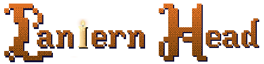

## Table of contents

- [Game Overview](#game-overview)
- [Characters](#characters)
- [Gameplay and Mechanics](#gameplay-and-mechanics)
- [World Design](#world-design)
- [Art and Audio](#art-and-audio)
- [User Interface](#user-interface)
- [Technology and Tools](#technology-and-tools)
- [Team Communication, Timeline, and Task Assignment](#team-communication-timeline-and-task-assignment)
- [Possible Challenges](#possible-challenges)

## Game Overview

<table style="border: none;">
    <tr style="border: none;">
        <td style="border: none;">
            Lantern Head™️ is an isometric, rogue-lite(-like) action/horror game in which light and shadow are a core gameplay element. Fight enemies, explore the world, and keep the flame alive 🔥
        </td>
        <td style="border: none;">
            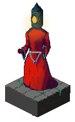
            
Created with Aseprite

        </td>
    </tr>
</table>

### Core Concept

<table style="border: none;">
    <tr style="border: none;">
        <td style="border: none;">
            Tasked with protecting a sacred light from the encroaching darkness, they must navigate the night and evade the darkness's minions. Chased by the "darkness" and its zealous supporters, the acolyte's mission is to ensure the flame remains lit, representing hope for another day. With just 5 minutes until dawn, every second counts, for if the flame is extinguished, fear will spread unchecked throughout the land.
        </td>
        <td style="border: none;">
            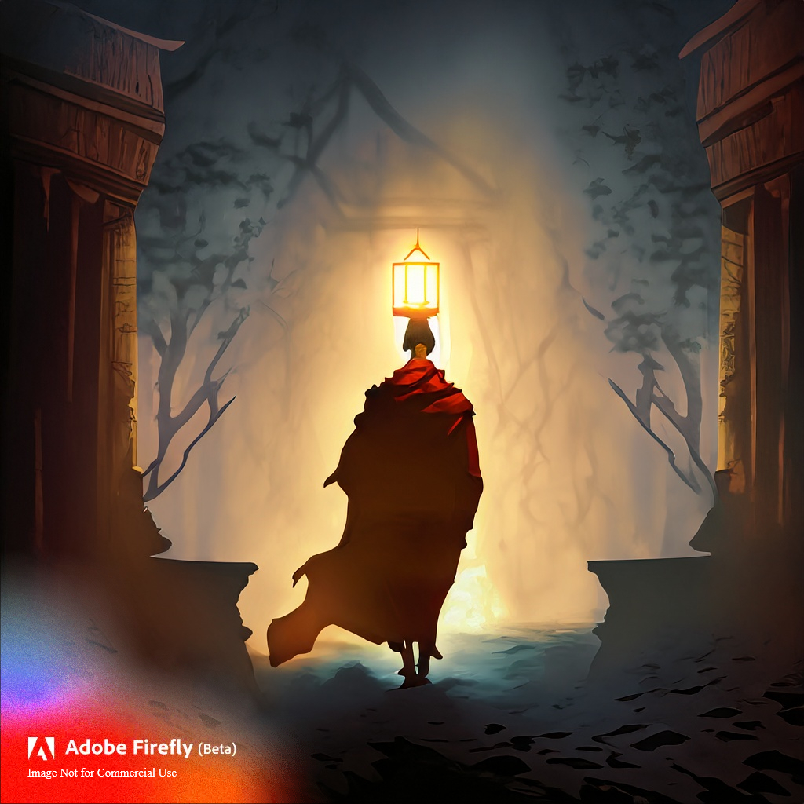
        </td>
    </tr>
</table>

### Genre

<b>Horror Survival</b>

<table>
    <tr>
        <td>
            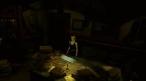
        </td>
        <td >
            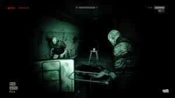
        </td>
            <td>
                 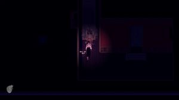
        </td>
    </tr>
</table>

Eternal Darkness (l.), Outlast (m.), Unknown (r.)

 

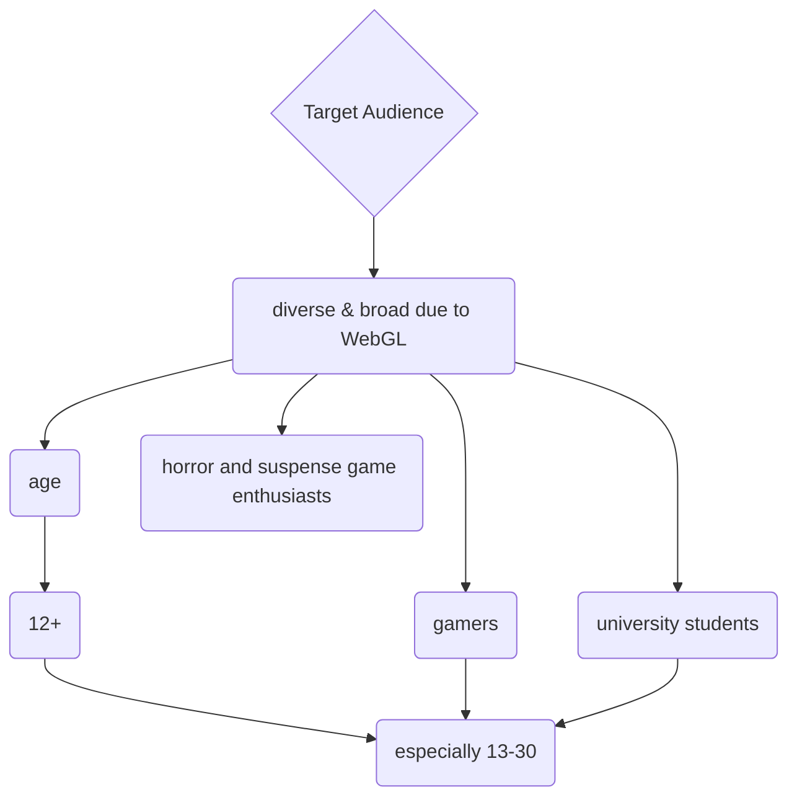
```mermaid
    graph TD;
    A{Target Audience}-->B(diverse & broad due to WebGL);
    B-->C(age);
    C-->D(12+);
    D-->E(especially 13-30);
    B-->F(gamers);
    B-->G(horror and suspense game enthusiasts);
    B-->H(university students);
    F-->E
    H-->E
```

### Unique Selling Points

<table style="border: none;">
    <tr style="border: none;">
        <td style="border: none;">
            <b>Light</b>💡 
            Acting as both a pivotal navigational guide and a direct indicator of health. Also, its glow is the only means to reveal concealed enemies.
        </td>
        <td style="border: none;">
            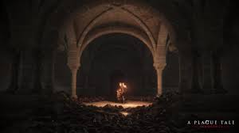
            
Inspiration: A Plague Tale

        </td>
    </tr>
</table>
Other Game Differentiators  

- Pixel art style
- Enemies are invisible (can be seen briefly when they attack or take damage)
- Strategy (resource utilization, how to deal with the enemy)

## Characters

1.  Main Character

    - The last keeper of the flame, tending to their god’s decaying temple as they struggle to keep the darkness out. As a reward for their devotion, they have been transformed into a living lantern.

        

            
             Image created using Aseprite
        

    - Inspiration:

    <table>
        <tr>
            <td>
                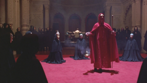
            </td>
            <td >
                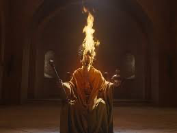
            </td>
            <td>
                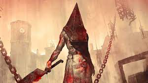
            </td>
        </tr>
    </table>
    
Eyes Wide Shut (l.), The Green Knight (m.), SilentHill (r.)

     

2.  Shadow Enemy

    - Shadow/ghost-looking creatures. This will be done by switching on the <b>Shadow-Only</b> option in [Mesh Renderer component - Lighting](https://docs.unity3d.com/Manual/class-MeshRenderer.html#lighting). More details described in [Enemies and Combat](#enemies-and-combat)

    - Inspiration:

    <table>
        <tr>
            <td>
                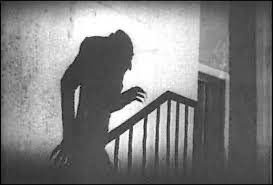
            </td>
            <td >
                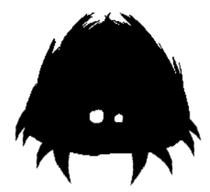
            </td>
            <td>
                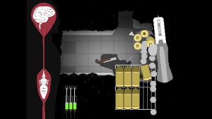
            </td>
        </tr>
    </table>
    
Nosferatu (1922) (l.), Crawling Horror from Don't Starve (m.), Endoparasitic (r.)

     

3.  Final Boss

    - The enemy that shows up in the last wave of the game. It is a massive shadow monster that merge from the small shadow monsters appear in the previous waves

    

        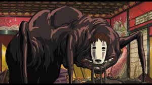 Source: No-Face from Spirited Away
    

4.  Helper Elf

    - A hourglass-like creature. It appears in the loading screen and at the start of the game to tell the player about the rules and the background. It also hints the player about hidden objects throughout the game.

    

        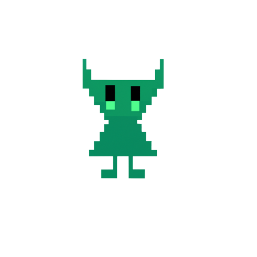
          Image generated by DALL·E 2
    

## Gameplay and Mechanics

### Core Gameplay Loop

<table style="border: none;">
    <tr style="border: none;">
        <td style="border: none;">
           <ul>
               <li>Explore the world, finding:
               <ul>
                   <li>potions and lantern oil</li>
                   <li><it>braziers</it>, permanent light sources that can be lit to give the player points</li>
               </ul>
               </li>
               <li>Fight and kill enemies</li>
               <li>Don't die</li>
           </ul>
        </td>
        <td style="border: none;">
            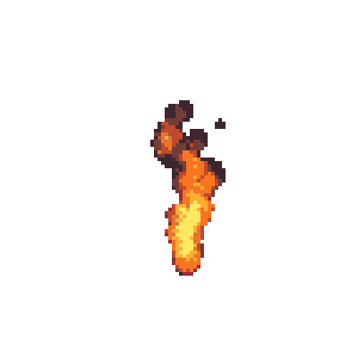
            <a href="https://codemanu.itch.io/pixelart-effect-pack">Source</a>
        </td>
    </tr>
</table>

### Player Movement

- 8-directional movement system (N, NE, E, SE, S, SW, W, NW)
- Walking backwards incurs speed penalty

### Enemies and Combat

- Enemies are **invisible**, ghost-like creatures with a melee attack

    
     Source: Nosferatu (1922)

- They can be spotted by **observing their shadows**, cast by the player's lantern or environmental light sources

    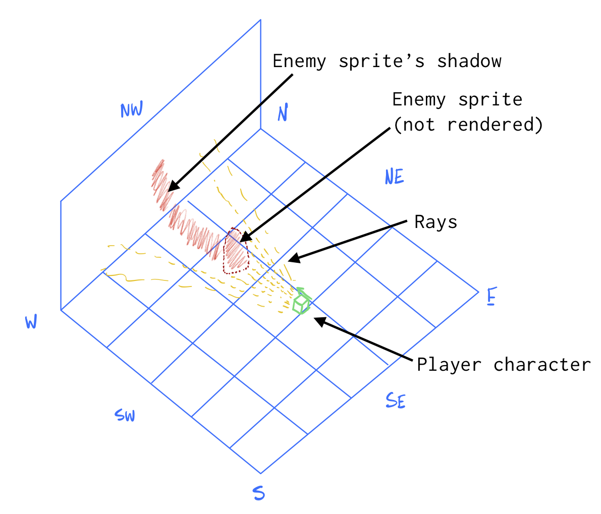

- Enemies briefly become visible when they:
  - Hit the player (Detection of hits via raycast function)
  - Take damage

<b>Health & Stats</b>

<table>
    <thead>
        <tr>
            <th>Attack type (player)</th>
            <th>Description</th>
            <th>Damage Shadow Enemy</th>
            <th>Damage Endboss</th>
        </tr>
    </thead>
    <tbody>
        <tr>
            <td>Melee attack</td>
            <td>Close-combat attack performed with hands</td>
            <td>35%</td>
            <td>15%</td>
        </tr>
        <tr>
            <td>Lantern attack</td>
            <td>Beam of light emanating from the player character damages any enemies in its path</td>
            <td>45%</td>
            <td>25%</td>
        </tr>
    </tbody>
</table>

- Around 6 enemy attacks will reduce the player to 0 health

### Lantern/Light feature

<table>
    <thead>
        <tr>
            <th>Fuel level</th>
            <th>Description</th>
        </tr>
    </thead>
    <tbody>
        <tr>
            <td>0-10%</td>
            <td>Vison: 10°  30% decreased movement speed   No use of special attack possible</td>
        </tr>
        <tr>
            <td>11-30%</td>
            <td>Vision: 50°  15% decreased movement speed  No use of lantern attack possible</td>
        </tr>
        <tr>
            <td>31-50%</td>
            <td>Vision: 80°  5% decreased movement speed  Lantern attack possible - 1/5th of fuel reserves per attack (half of the damage points apply)</td>
        </tr>
        <tr>
            <td>51-70%</td>
            <td>Vision: 110°  normal movement speed  Lantern attack possible - 1/5th of fuel reserves per attack</td>
        </tr>
        <tr>
            <td>71-90%</td>
            <td>Vision: 140°  5% increased movement speed  Lantern attack possible - 1/5th of fuel reserves per attack</td>
        </tr>
        <tr>
            <td>91-100% </td>
            <td>Vision: 180°  10% increased movement speed  Lantern attack possible - 1/5th of fuel reserves per attack (double of the damage points apply)</td>
        </tr>
    </tbody>
</table>

- Lantern brightness also determines the likeliness of attracting enemies. Dimmer light means less likely to attract enemies and vice versa.

Inspiration for games where light is important for gameplay include Cryospace and Amnesia: The Dark Descent.

   <a href="https://www.dsogaming.com/news/cryospace-is-a-new-isometric-horror-game-heavily-inspired-by-alien-and-philip-k-dick-novels/">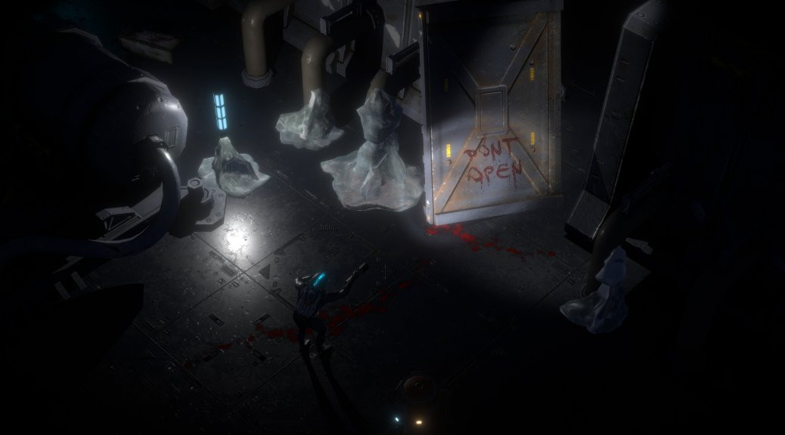</a> 
  Gameplay still from Cryospace showing limited visibility and a player controlled light source

### Camera/View

- Fixed rotation 3rd person isometric with approx. 45° viewing angle
- Player is locked to centre of screen (camera moves with player movement)
- When the player reaches the edge of the game world, they will be slightly off centre; this allows the player to see more of the game world while near its edge.
  - This is demonstrated in the diagram below. Note how in FOV 2 the player is off-centre.

    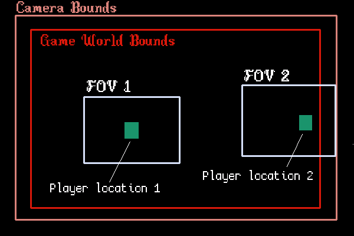

   
- We have decided to use a moving camera as it can make the gameplay feel more dynamic - well suited to the action/horror genre

Underrail (2015) is a good example of the intended viewing angle:

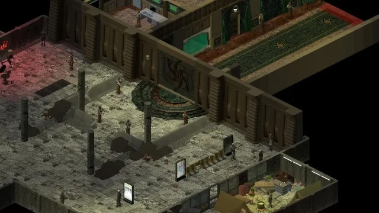

And Synthetik (2018) uses a camera locked to the players movements:

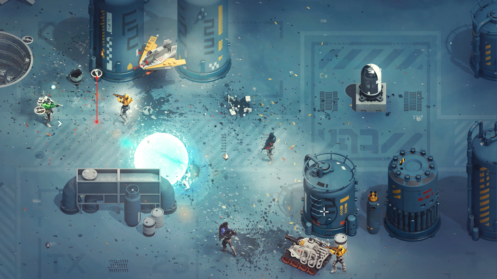

### Controls

    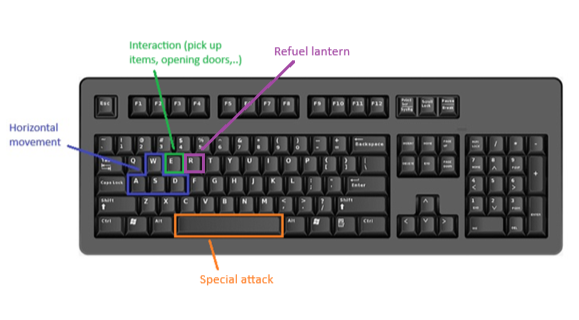
    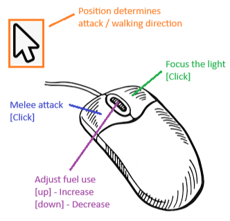
     Note: Player walking speed will be slower when walking <i>backwards</i> (e.g. facing north and walking south).

* Left Shift to *dash*, briefly increasing movement speed.

### Progression

As a roguelite-inspired game, Lantern Head features permadeath and items that do not persist between playthroughs.

Within a single playthrough, difficulty will increase due to

- Increased enemy spawn rates
- Presence of enemies with higher stats
- Attrition of resources if the player overuses their potions/lantern oil

<table style="border: none;">
    <tr style="border: none;">
        <td style="border: none;">
   The player's power level will also increase over the course of the game by finding <it>potions</it>, which have effects including:
            <ul>
                <li>Increasing player speed</li>
                <li>Increasing lantern brightness</li>
                <li>Increasing lantern illumination angle</li>
                <li>Increasing max health and max lantern oil</li>
            </ul>
        </td>
        <td style="border: none;">
            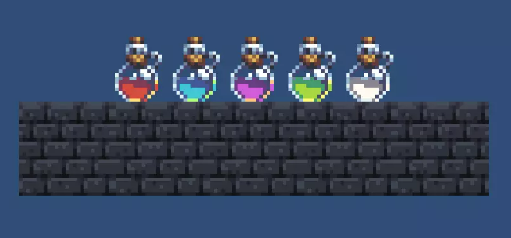
            <a href="https://assetstore.unity.com/packages/2d/environments/pixel-potions-with-animation-118801">Source</a>
        </td>
    </tr>
</table>

To encourage replayability, the game will feature a **scoring system** based on:

- The number of enemies killed
- The number of _braziers_ that are lit by the player

There will also be **achievements** awarded to players for unusual or impressive feats, such as:

- Completing the game without killing an enemy
- Completing the game without lighting a single candle
- Completing the game without using the lantern attack
- Dying within the first minute, etc.

## World Design

Lantern Head takes place within the confines of an abandoned religious compound, in the style of an old-world monastery or cathedral.

This temple shows signs of advanced decay, as plant growth gradually reclaims the crumbling masonry, giving the player the sense that they are the last defender of this place against the unknown and wild forces outside its walls.

One inspiration for this is the abandoned 12th-century Monastery of Santa Maria de Seiça in Portugal:

    
    

And this abandoned church photographed by Roman Robroek:

    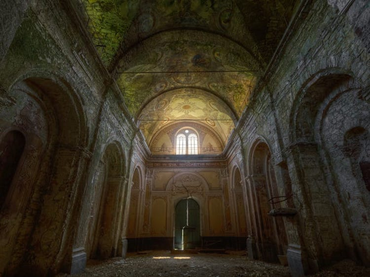

Other inspirations:

<table>
    <tr>
        <td >
            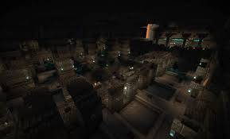
        </td>
        <td>
            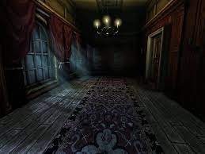
        </td>
        <td>
            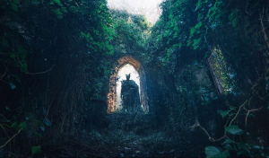
        </td>
    </tr>
</table>

Minecraft (l.), Amnesia - The Dark Descent (m.), The Green Knight (r.)

### Layout

The game will take place entirely indoors. The level design will take inspiration from real-life religious buildings.

        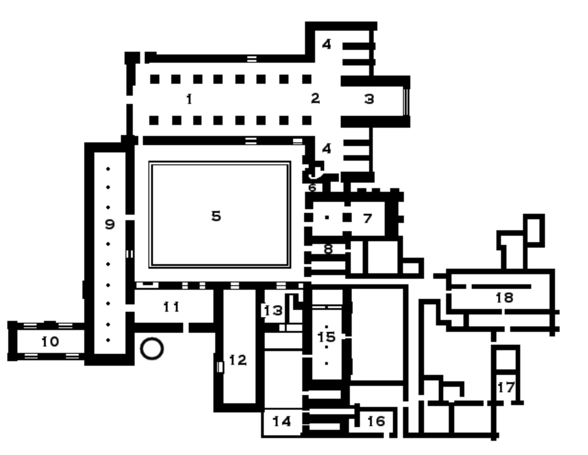
        
Kirkstall Abbey floor plan. Source: <a href="https://commons.wikimedia.org/wiki/File:Kirkstall_Abbey_ground_plan.GIF">Wikimedia Commons</a>.

The world will feature sections ranging from grand halls to claustrophobic corridors.

The game will use procedural generation for both:

- Generating room layouts, and
- Procedural combination of generated rooms

Rooms will be oriented along a shared axis.

### Game World Graphics and Physics

The game world will be rendered in "2.5D" using a pixel art tileset. The tilemap will be overlayed with a static collider for simple player-object and enemy-object collisions.

No elements in the game world will require other physics simulation.

Light and shadow is an important gameplay element in Lantern Head. Lighting will be handled by Unity's 2D Universal Render Pipeline (URP), which enables 2D objects (such as sprites) to interact with light and cast shadows as if they were 3D objects.

Towards the very end of the game, the sun will begin to rise. It is intended that a gradient of light intensity and color will provide a visual guide to the player as to how long the need to survive. A global lighting gradient mockup, with respect to game time, can be seen below.

    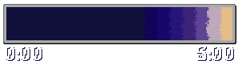
    
Demonstration of lighting coming through windows across the 5 minutes of game time. Created using Aseprite.
    

### Interactivity

- _Environmental lighting_: candles and braziers. Able to be snuffed out by enemies and relit by the player

    <figure>
        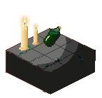
    </figure>

- _Oil containers_: found throughout map, essential for refilling player's lantern

    <figure>
        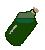
    </figure>

- _Health potions_ to heal player character

    <figure>
        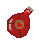
    </figure>

- _Doors_: manually opened to enter certain rooms
- _Notes_: add flavour

## Art and Audio

<b> Art Style: Pixel Art </b>

Our team loves the pixel art style and thinks that it will be the best fit for our game for the following reasons:

- <b>Unique Aesthetic Appeal</b>: Utilizing pixel art for a horror game adds a distinctive visual charm that stands out in a genre dominated by realistic graphics.
- <b>Engage player's imagination</b>: Pixel art invites players to engage their imaginations, filling in the gaps between pixels with their perceptions of fear. This active participation can intensify the player's overall horror experience.
- <b>Showcase the potential of pixel art style</b>: Pushing the boundaries of pixel art by demonstrating that pixel art can effectively evoke fear, suspense, and mystery.

<b>Color and Atmosphere</b>: The game is going to implement a high contrast between light and shadow with mainly dark blue or green color to build an overall suspenseful and dark atmosphere

<b> Concept Art and References for the Art Style </b>

    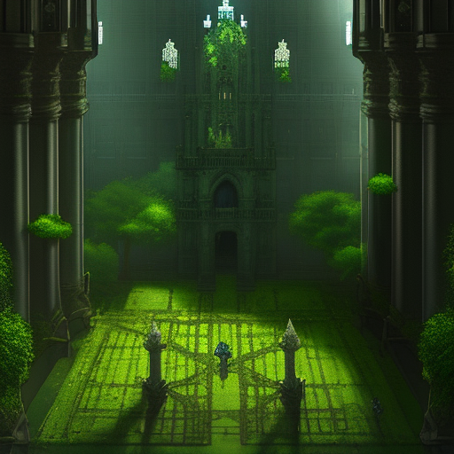
     Image generated by Automatic 1111

    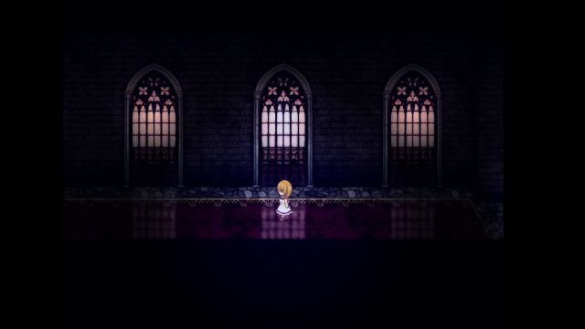
     Source: The Witch's House

    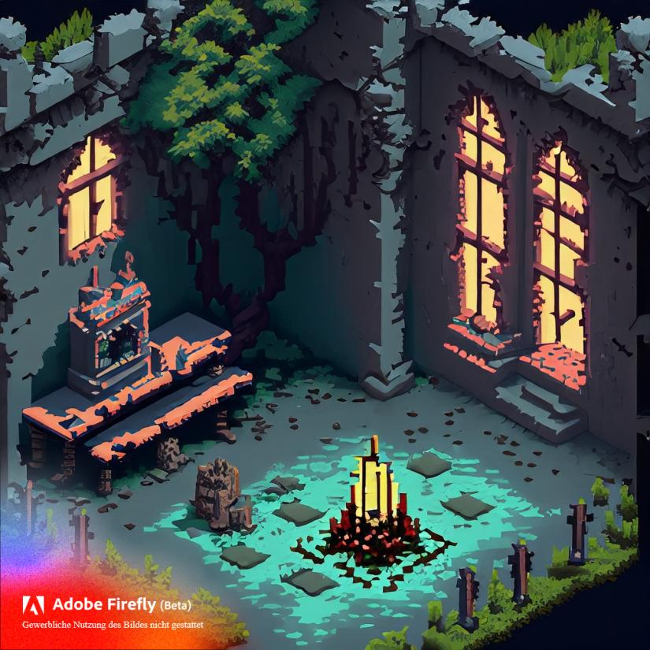
    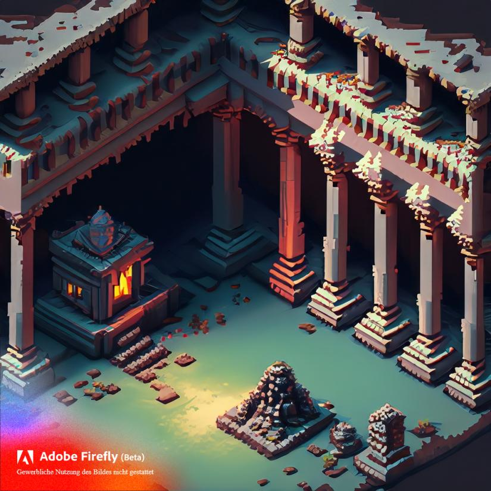
     Images generated by Adobe Firefly

 

<b>Game audio mainly source from:</b>

1. [Opengameart.org](https://opengameart.org/)
2. [Pixabay](https://pixabay.com/)
3. [Youtube](https://www.youtube.com/)

<b>Feelings / Styles that we want to convey through the soundtracks and sound effects</b>

- Minimalistic
- Suspenseful
- Dark
- Gothic

 

<b>List of Candidate Soundtracks</b>
| Soundtracks | Sources|
| -------- | -------- |
| Starting Screen | [György Ligeti - Atmospheres](https://youtu.be/RCNzwdLwA8g?t=289) |
| Credit | [Zoltán Kodály: Epigrams For Double Bass And Piano: 1](https://www.youtube.com/watch?v=-HAQlKL1g5g) |
| Loading Screen | [Alexandr Zhelanov - Mystery manor](https://opengameart.org/content/mystery-manor) |
| In-game Background | [Brandon75689 - Cave Theme](https://opengameart.org/content/cave-theme)  [Dark Ambient Music](https://www.youtube.com/watch?v=PN1tG6y-MsY)  [Dark Gothic Music of Abandoned Castles and Forgotten Temples](https://www.youtube.com/watch?v=MwToTZc9qOk) [Eric Matyas - Dystopian Wasteland](https://opengameart.org/content/dystopian-wasteland) |
| Game Over | [Clement Panchout - Game Over Jingles Pack - 48 GameOverJingle Saturday](https://opengameart.org/content/69-game-over-jingles-pack) |
| Game Complete / Ending Scene | [Skrjabin: Le poème de l’extase ∙ hr-Sinfonieorchester ∙ Alain Altinoglu](https://www.youtube.com/watch?v=Ni87KKnYKHU) |

 

<b>List of Candidate [Sound Effects](https://github.com/COMP30019/project-1-knibbe/tree/42b209116b04df27b42ec9345d7ecce6760bd225/SoundEffects)</b>
| Sound Effects | References |
| -------- | -------- |
| Attack Enemy | [Fuel explosion](https://mixkit.co/free-sound-effects/fire/) |
| Close Door | [Pixabay - Door open and close](https://pixabay.com/sound-effects/door-open-and-close-65541/) |
| Enemy Pushes And Breaks The Door | [Pixabay - Wood break](https://pixabay.com/sound-effects/wood-break-40011/)  [Pixabay - pounding-on-door](https://pixabay.com/sound-effects/pounding-on-door-44023/)|
| Fire Woosh when Enemy Approaches | [Mixkit - Wizard fire woosh / Ghost fire woosh](https://mixkit.co/free-sound-effects/fire/) |
| Heal | [Opengameart.org - 3 heal spells](https://opengameart.org/content/3-heal-spells) |
| Heart Beat When Enemy Approaches | [ShidenBeatsMusic – Heartbeat sound effect](https://pixabay.com/sound-effects/heartbeat-sound-effect-111218/)   [MrSnooze I Background Music for Videos - Heartbeat Sound Effect](https://www.youtube.com/watch?v=fLXLo3rEdrE) |
| Item Pick Up | [Pixabay – Item Equip](https://pixabay.com/sound-effects/item-equip-6904/) |
| Lantern Refill | [Pixabay – Oil lantern open and close](https://pixabay.com/sound-effects/oil-lantern-open-and-close-27693/) |
| Light A Match | [Pixaby - 071684_light_match.wav](https://pixabay.com/sound-effects/071684-light-matchwav-89669/) |
| Menu Hover | [Opengameart.org - UI Soundpack by m1chiboi - bleeps and clicks](https://opengameart.org/content/ui-soundpack-by-m1chiboi-bleeps-and-clicks) |
| Menu Select | [Opengameart.org - Zippo click sound](https://opengameart.org/content/zippo-click-sound) |

 

<b>Game Assets Mainly Source / Generate From: </b>

1. [Unity Assets Store](https://assetstore.unity.com/)
2. [GameDev Market](https://www.gamedevmarket.net/)
3. [itch.io](https://itch.io/)
4. [Asesprite](https://www.aseprite.org/)

<b> List of Candidate Assets </b>

1. Temple / Castle Environment
   a. [Szadi Art. - Rogue Fantasy Castle](https://assetstore.unity.com/packages/2d/environments/rogue-fantasy-castle-164725)
   

        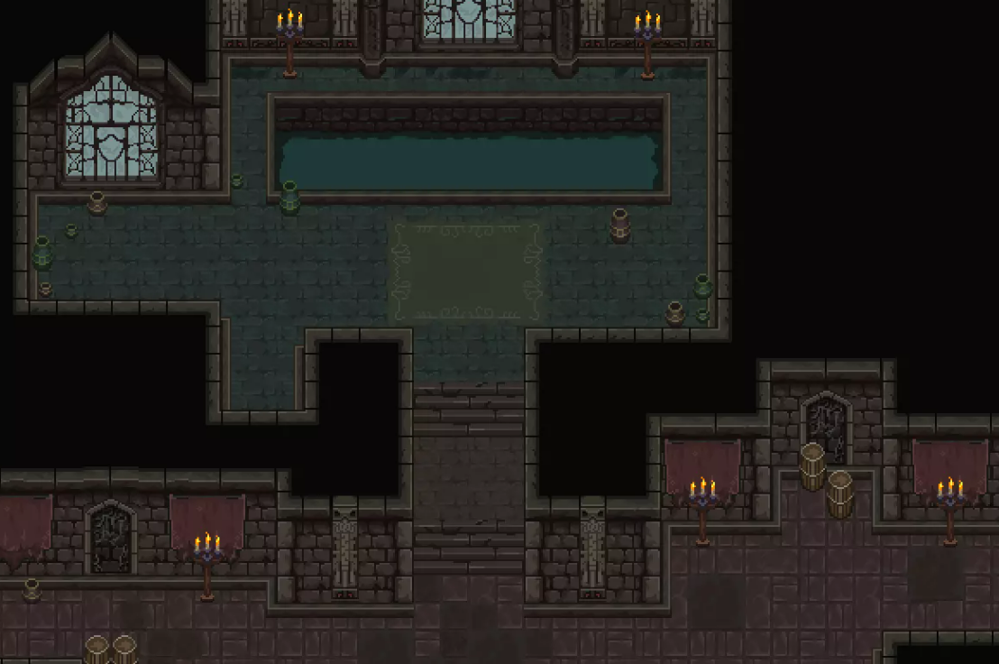
        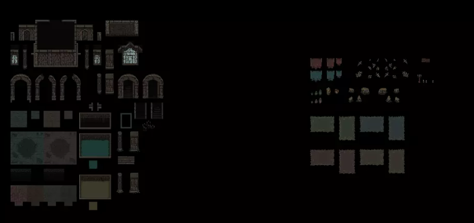
    

2. Potion / Fuel

   a. [Porforever - Pixel Potions (with Animation)](https://assetstore.unity.com/packages/2d/environments/pixel-potions-with-animation-118801)
   

        
    

3. Fire and player's attack effect

   a. [Free Pixel Effects Pack - CodeManu](https://codemanu.itch.io/pixelart-effect-pack)
   

        
        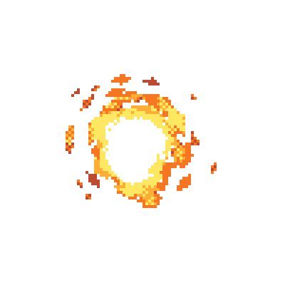
    

## User Interface

    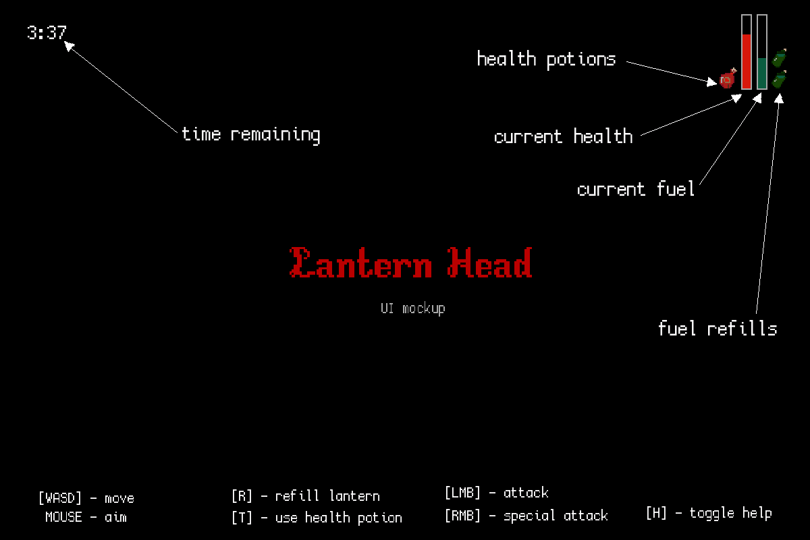
    
Mockup for Lantern Head user interface.

## Technology and Tools

<table align="center">
    <thead>
        <tr>
            <th style="flex: 1; text-align: center;"><b>Tool</b></th>
            <th style="flex: 1; text-align: center;"><b>Purpose</b></th>
            <th style="flex: 1; text-align: center;"><b>Tool</b></th>
            <th style="flex: 1; text-align: center;"><b>Purpose</b></th>
        </tr>
    </thead>
    <tbody>
        <tr>
            <td>
                

                    

                        
                    

                

            </td>
            <td>
            Unity  
            - Development of the game  
            - Unity 2D URP
            </td>
            <td>
                

                    

                        
                    

                

            </td>
            <td>
            Visual Studio Code  
            - C# scripting  
            </td>
        </tr>
        <tr>
            <td>
                

                    

                        
                    

                

            </td>
            <td>
            GitHub  
            - Game repository  
            - Issues tab for todo's and discussions  
            - Wiki tab for instructions / guides
            </td>
            <td>
                

                    

                        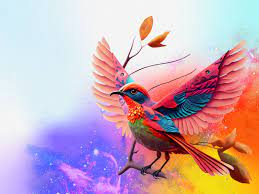
                    

                

            </td>
            <td>
            Adobe Firefly  
            - AI image creation  
            </td>
        </tr>
        <tr>
            <td>
                

                    

                        
                    

                

            </td>
            <td>
            Automatic 1111  
            - AI image creation  
            </td>
            <td>
                

                    

                        
                    

                

            </td>
            <td>
            Audacity  
            - Audio editing  
            </td>
        </tr>
        <tr>
            <td>
                

                    

                        
                    

                

            </td>
            <td>
            Aseprite  
            - Image editor for pixel art drawing and animation
            </td>
            <td>
                

                    

                        
                    

                

            </td>
            <td>
            DALL·E 2  
            - AI image creation
            </td>
        </tr>
    </tbody>
</table>

## Team Communication, Timeline, and Task Assignment

### Team Communication

<table align="center">
    <thead>
        <tr>
            <th style="flex: 1; text-align: center;"><b>Tool</b></th>
            <th style="flex: 1; text-align: center;"><b>Purpose</b></th>
            <th style="flex: 1; text-align: center;"><b>Tool</b></th>
            <th style="flex: 1; text-align: center;"><b>Purpose</b></th>
        </tr>
    </thead>
    <tbody>
        <tr>
            <td>
                

                    

                        
                    

                

            </td>
            <td>
            Whatsapp  
            - Fast communication
            </td>
            <td>
                

                    

                        
                    

                

            </td>
            <td>
            Google Drive  
            - File share  
            - Working together on documents 
            </td>
        </tr>
        <tr>
            <td>
                

                    

                        
                    

                

            </td>
            <td>
            Discord  
            - Meetings  
            - Exchanging ideas
            </td>
            <td>
                

                    

                        
                    

                

            </td>
            <td>
            Monday  
            - Project management  
            - Delegate tasks  
            - Track team's progress
            </td>
        </tr>
    </tbody>
</table>

### Timeline

    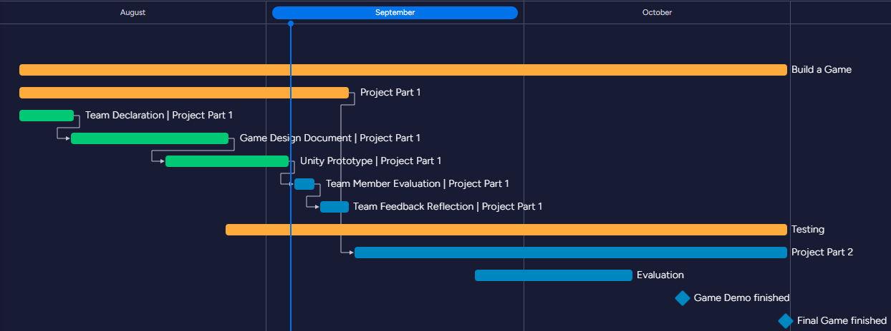
    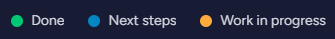

### Task Distribution

| Task                 | Main Responsibility | Collaboration |
| -------------------- | ------------------- | ------------- |
| Project Management   | Linda               | All others    |
| Ideas                | -                   | All           |
| Game Design Document | -                   | All           |
| Art & Design         | Joe                 | All others    |
| Audio                | Katherine           | All others    |
| Development          | All                 | -             |
| Testing              | Muhammed            | All others    |
| Evaluation           | Linda               | All others    |

## Possible Challenges

| Challenges   | Resolution approach |
| ------------ | ------------------- |
| Avoiding situations where players can win by hiding in a corner for the entire game | Enemies spwan around the main character |
| Design appropriate level difficulty that is challenging but not too difficult | Testing, Evaluation |
| Time constraints (work, other subjects) | Good time management, efficient working, equal distributed tasks |
| Unity, GitHub or Scripting problems | Attend classes, ask questions early enough, own research |
| Merge conflicts | Utilize Communication channel to schedule commits |
